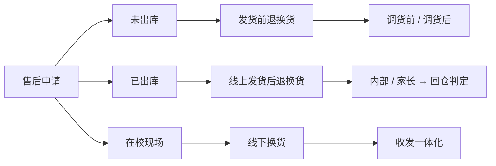
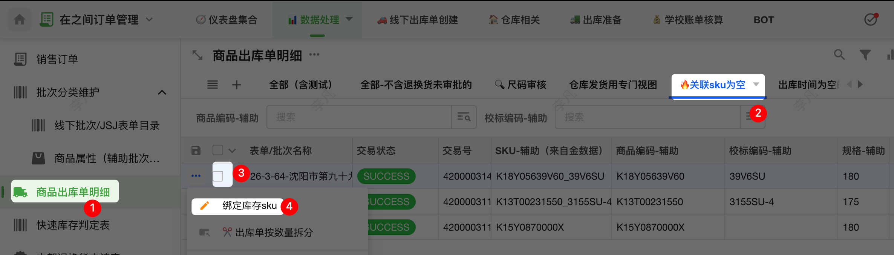
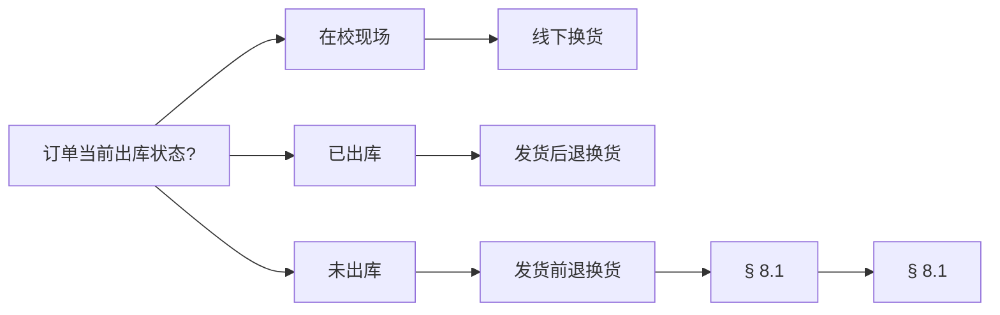
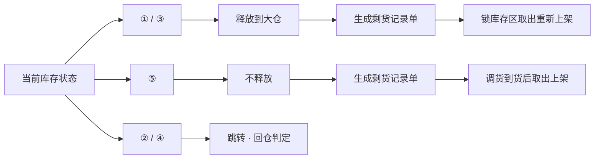

# 订单全流程标准工作流程

> 订单全流程 SOP · v6 · 2026-05

从订单生成到出库完成的主线，加上与之并行的售后分支。每一个操作都按统一卡片描述，方便快速定位执行。

## 目录

- [阅读指南](#intro)
- [生命周期总图](#lifecycle)
- [一、订单创建](#create)
- [二、订单审核](#review)
- [三、库存判定](#inventory)
- [四、商品采购](#purchase)
- [五、出库准备](#prep)
- [六、商品出库](#ship)
- [七、售后总览](#afters)
- [八、发货前退换货](#pre-ship)
- [九、发货后退换货](#post-ship)
- [十、线下换货](#offline)
- [十一、基础数据维护](#data)
  - [新学校建档](#data-school)
  - [新商品建档](#data-sku)
  - [订单分类](#data-class)
  - [尺码 / 套装 / 仓库](#data-misc)

### 阅读指南

主线是：订单创建 → 审核 → 库存判定 → 采购 → 出库准备 → 出库。售后是一组并行分支，订单在主线任何阶段都可能进入售后，处理完后回到主线对应状态。

每一个具体动作都按统一的"操作单元"卡片描述：

- **触发**： 什么时候做。例：订单进入"待判定"状态。
- **位置**： 在哪个表 / 视图。例：[商品出库单明细](https://www.mingdao.com/app/8bb27a4a-87c0-4a49-8adf-052857408bb6/67dcc27570570d576ae2234a/67dcc273a24baef2d71a4754) → [🔥 关联 SKU 为空](https://www.mingdao.com/app/8bb27a4a-87c0-4a49-8adf-052857408bb6/67dcc27570570d576ae2234a/67dcc273a24baef2d71a4754/67dcc273a24baef2d71a476f)。
- **步骤**：
1. 第一件事
2. 第二件事
- **结果**： 系统会发生什么。例：订单出现在《销售订单》。
- **异常**： 常见错误 + 处理方式。

#### 符号约定

文档中所有专有标记都用统一的视觉样式呈现，便于扫读时立刻识别类型。

| 类型 | 样式 | 含义 |
| --- | --- | --- |
| 工作表 | [商品出库单明细](https://www.mingdao.com/app/8bb27a4a-87c0-4a49-8adf-052857408bb6/67dcc27570570d576ae2234a/67dcc273a24baef2d71a4754) | 系统中的数据表，是订单与状态的载体 |
| 视图 | [🔥 关联 SKU 为空](https://www.mingdao.com/app/8bb27a4a-87c0-4a49-8adf-052857408bb6/67dcc27570570d576ae2234a/67dcc273a24baef2d71a4754/67dcc273a24baef2d71a476f) | 工作表的筛选 / 排序视角 |
| 按钮 | 发起判定 | 可点击的系统动作 |
| 字段 | 指定发货仓库 | 表中的某一列 |
| 状态值 | 锁库存 | 订单 / 库存的离散状态 |
| 位置 | 《销售订单》→[只付运费](https://www.mingdao.com/app/8bb27a4a-87c0-4a49-8adf-052857408bb6/67dcc27570570d576ae2234a/67dcc273a24baef2d71a4757/67dcc273a24baef2d71a4759) | 表 + 视图的完整路径 |
| 系统自动 | 自动推送至《销售订单》 | 无需人工干预，系统触发后自动发生 |

#### 警示等级

文档中所有提醒分为两个等级，按视觉权重区分：

   不可逆 · 警示 数据损坏 / 难以回滚

独立成块、放在小节最前。常见：删除已审核数据、手动建虚拟移仓单、直接删退换货等。一旦出错难以回滚。

> **流程前提 / 易遗漏**——保留在步骤原位。是必要校验或常被忽略的细节，例如：发财务前勾选「已调货」、核对推送条数等。

---

### 订单生命周期

下图展示主线 8 个阶段。售后分支与主线并行，订单在任意阶段都可进入售后再回流到对应状态。

#### 并行的售后三分支

每个分支对应主线的某个状态切片：

---

### 一、订单创建

把多渠道家长下单的数据统一汇聚到 [商品出库单明细](https://www.mingdao.com/app/8bb27a4a-87c0-4a49-8adf-052857408bb6/67dcc27570570d576ae2234a/67dcc273a24baef2d71a4754)，作为后续所有流程的源头。

#### 1.1 线上 · 金数据 → 明道云

- **触发**： 家长在金数据下单后，由 webhook 自动推送。
- **位置**： 金数据后台 → 表单设置 → 数据推送。接收方为 [销售订单](https://www.mingdao.com/app/8bb27a4a-87c0-4a49-8adf-052857408bb6/67dcc27570570d576ae2234a/67dcc273a24baef2d71a4757)。
- **步骤**：
1. 配置 webhook 地址（按场景选择）：

| 场景 | 地址前缀 `https://api.mingdao.com` |
| --- | --- |
| 需要在线支付 | …/workflow/hooks/NjdkY2MyNzJmYTFkMDk1YmIwZWNlNGYw |
| 无需在线支付 / 混合 | …/workflow/hooks/Njg2MzNjNDJjNDRmYTUwMzExMDFiNDQ1 |
| 伊为伊 | …/workflow/hooks/Njg2MzcxNGRjNDJjNzAzZmVjZmU5YmJm |

2. 家长提交后 自动推送至 [销售订单](https://www.mingdao.com/app/8bb27a4a-87c0-4a49-8adf-052857408bb6/67dcc27570570d576ae2234a/67dcc273a24baef2d71a4757)。
- **结果**： 订单出现在 [销售订单](https://www.mingdao.com/app/8bb27a4a-87c0-4a49-8adf-052857408bb6/67dcc27570570d576ae2234a/67dcc273a24baef2d71a4757)，并同步生成 [商品出库单明细](https://www.mingdao.com/app/8bb27a4a-87c0-4a49-8adf-052857408bb6/67dcc27570570d576ae2234a/67dcc273a24baef2d71a4754)。
- **异常**： 漏推 → 金数据后台 → 数据页面 → 给目标数据打任意颜色标记 → 触发补推送，回 [销售订单](https://www.mingdao.com/app/8bb27a4a-87c0-4a49-8adf-052857408bb6/67dcc27570570d576ae2234a/67dcc273a24baef2d71a4757) 验证；记录在 [金数据漏推记录表](https://www.mingdao.com/app/8bb27a4a-87c0-4a49-8adf-052857408bb6/67dcc27570570d576ae2234a/67dcc273a24baef2d71a4720)。

#### 1.2 线下批量导入 · 审批

- **触发**： 学校批量订购、需一次性导入多笔订单。
- **位置**：  [线下导入出库单（非调换）](https://www.mingdao.com/app/8bb27a4a-87c0-4a49-8adf-052857408bb6/67dcc27570570d576ae22349/67dcc273a24baef2d71a4747) · [付款记录](https://www.mingdao.com/app/8bb27a4a-87c0-4a49-8adf-052857408bb6/67dcc27570570d576ae22349/68dba0ae8f5940d7519557f5)
- **步骤**：
1. 在 [线下导入出库单（非调换）](https://www.mingdao.com/app/8bb27a4a-87c0-4a49-8adf-052857408bb6/67dcc27570570d576ae22349/67dcc273a24baef2d71a4747)：
  - 按模板填 Excel（学校 / 款号 / 规格 / 数量 / 收件人 / 金额）。
  - 导入 → 核对字段映射 → 确定。
2. 在 [付款记录](https://www.mingdao.com/app/8bb27a4a-87c0-4a49-8adf-052857408bb6/67dcc27570570d576ae22349/68dba0ae8f5940d7519557f5) 点击按钮发起审批，登记付款情况：
  - 未收款 → 付款渠道选 欠款
  - 不需要付款 → 付款渠道选 无需付款
- **结果**： 审批通过后，订单进入 [商品出库单明细](https://www.mingdao.com/app/8bb27a4a-87c0-4a49-8adf-052857408bb6/67dcc27570570d576ae2234a/67dcc273a24baef2d71a4754)，等待二、订单审核。
- **异常**：

| 原因 | 检查方法 | 解决 |
| --- | --- | --- |
| 无存货档案 / SKU | 在 [商品 SKU 及库存状态](https://www.mingdao.com/app/c84a3de1-1811-4cd0-9b96-e4c638432b31/67dcc27570570d576ae22359/67dcc273a24baef2d71a4756) 搜「款号+规格」 | 按 A.6 商品 SKU 维护添加 |
| 学校商品目录无此 SKU | 在 [学校商品目录名册](https://www.mingdao.com/app/8bb27a4a-87c0-4a49-8adf-052857408bb6/67dcc27570570d576ae22349/67dcc273a24baef2d71a4725) 搜「款号+学校」 | 新增目录记录 |
| 款号格式错误 | 看导入报错 | 修 Excel |
| 必填字段空 | 看报错 | 补字段 |

> 维护 [学校商品目录名册](https://www.mingdao.com/app/8bb27a4a-87c0-4a49-8adf-052857408bb6/67dcc27570570d576ae22349/67dcc273a24baef2d71a4725) 时，推荐从 [商品属性（辅助批次管理单价）](https://www.mingdao.com/app/8bb27a4a-87c0-4a49-8adf-052857408bb6/67dcc27570570d576ae22354/67dcc273a24baef2d71a473c) 导出已推送过的数据 → 导入到目录，比手填准确；**导入前先备份**。

#### 1.3 客服联系订购

- **触发**： 家长零散付款、未走标准下单流程，由客服补单。
- **位置**： [其他业务付款收款记录](https://www.mingdao.com/app/8bb27a4a-87c0-4a49-8adf-052857408bb6/67dcc27570570d576ae22349/67dcc273a24baef2d71a473d)
- **步骤**：
1. 客服与家长沟通，家长填收件信息 + 金额。
2. 家长付款 → 记收件手机号。
3. 找到对应付款记录 → 一键创建客服销售订单。
4. 补订单信息 → 推送订单。
- **结果**： 订单进入 [商品出库单明细](https://www.mingdao.com/app/8bb27a4a-87c0-4a49-8adf-052857408bb6/67dcc27570570d576ae2234a/67dcc273a24baef2d71a4754)。

---

### 二、订单审核

在订单进入库存判定之前，确认每条明细的 SKU 关联、尺码合理性、付款类型。三件事都在 [商品出库单明细](https://www.mingdao.com/app/8bb27a4a-87c0-4a49-8adf-052857408bb6/67dcc27570570d576ae2234a/67dcc273a24baef2d71a4754) 完成。

#### 2.1 关联 SKU

- **触发**： 订单创建后系统自动尝试关联；需要审核确认是否全部匹配成功。
- **位置**： [商品出库单明细](https://www.mingdao.com/app/8bb27a4a-87c0-4a49-8adf-052857408bb6/67dcc27570570d576ae2234a/67dcc273a24baef2d71a4754) → [🔥 关联 SKU 为空](https://www.mingdao.com/app/8bb27a4a-87c0-4a49-8adf-052857408bb6/67dcc27570570d576ae2234a/67dcc273a24baef2d71a4754/67dcc273a24baef2d71a476f)
- **步骤**：
1. 打开视图 → 若为空，跳过本节。
2. 视图有数据 → 关联商品 SKU 让系统重试。
3. 仍有数据 → 检查 [商品 SKU 及库存状态](https://www.mingdao.com/app/c84a3de1-1811-4cd0-9b96-e4c638432b31/67dcc27570570d576ae22359/67dcc273a24baef2d71a4756) 是否存在该商品；不存在按 A.6 商品 SKU 维护 添加后回视图重试。

在 [🔥 关联 SKU 为空](https://www.mingdao.com/app/8bb27a4a-87c0-4a49-8adf-052857408bb6/67dcc27570570d576ae2234a/67dcc273a24baef2d71a4754/67dcc273a24baef2d71a476f) 视图中勾选记录，然后点击 绑定库存sku 让系统重新关联。

- **结果**： 视图为空即视为通过。
- **异常**： 关联逻辑：商品款号-辅助 = SKU 表款号 **且** 规格-辅助 = SKU 表规格，缺一不可。

#### 2.2 尺码审核

- **触发**： 系统标记"标准尺码与选择尺码相差 > 3"或对照表缺数据。
- **位置**： [商品出库单明细](https://www.mingdao.com/app/8bb27a4a-87c0-4a49-8adf-052857408bb6/67dcc27570570d576ae2234a/67dcc273a24baef2d71a4754) → [🔍 尺码审核](https://www.mingdao.com/app/8bb27a4a-87c0-4a49-8adf-052857408bb6/67dcc27570570d576ae2234a/67dcc273a24baef2d71a4754/67dcc273a24baef2d71a4770)
- **步骤**：
1. 打开视图，逐条查看异常类型。
2. 按下表对应处理：

| 异常 | 示例 | 处理 |
| --- | --- | --- |
| 体重单位错 | 50 公斤填成 50（系统按斤算） | 联系家长改 |
| 对照表缺数据 | 身高 185 无对应尺码 | 按 A.5 身高尺码对照表 补 |
| 家长故意选大 / 小码 | 想买大一码明年穿 | 备注 + 保留家长选择 |
| BMI 偏离正常区间 | 体型显示"超重 / 偏瘦" | 结合 体型 字段提示，与家长确认款式 |

- **结果**： 视图为空 / 数据合理 → 进入下一节。

#### 2.3 只付运费订单

- **触发**： 家长支付金额仅覆盖运费，未付商品款。
- **位置**： [销售订单](https://www.mingdao.com/app/8bb27a4a-87c0-4a49-8adf-052857408bb6/67dcc27570570d576ae2234a/67dcc273a24baef2d71a4757) → [可能只付了运费](https://www.mingdao.com/app/8bb27a4a-87c0-4a49-8adf-052857408bb6/67dcc27570570d576ae2234a/67dcc273a24baef2d71a4757/67dcc273a24baef2d71a4759)
- **步骤**：
1. 应用筛选 只付运费不看他。
2. 全选 → 编辑，在 备注 填"只付运费"。
3. 只付物流费退款 完成。
- **结果**： 系统排队退款。

---

### 三、库存判定

把订单分流到三种状态：锁库存（库存充足）/ 拆换标 / 调货中（采购）。

**拆换标**：把其他商品的校标换成扣货商品的校标，让那件货顶上来用。是否能拆换由 **业务初判 + 裁缝复核** 决定。

#### 3.1 发起整单出库快速判定

- **触发**： 订单审核通过、出库状态 为 待判定。
- **位置**： [商品出库单明细](https://www.mingdao.com/app/8bb27a4a-87c0-4a49-8adf-052857408bb6/67dcc27570570d576ae2234a/67dcc273a24baef2d71a4754)
- **步骤**：
1. 选目标行 → 把 出库状态 转 库存判定中。
2. 填写库存判定单 → 手动新建 [快速库存判定表](https://www.mingdao.com/app/8bb27a4a-87c0-4a49-8adf-052857408bb6/67dcc27570570d576ae2234a/67dcc273a24baef2d71a4734) 并填齐字段。
3. 选判定模式（见 3.2）。
4. 发起判定。
- **结果**： 系统输出判定结果，按 3.3 分流。
- **异常**： 核对 需要判定数量 = 完成判定数量。不相等 → 重做；多次仍不一致 → 群里 @ 李凡。

#### 3.2 三种判定模式

   模式 A

##### 指定仓库优先

优先消耗某个仓的库存。例：力旺高中仓积压货。

 **步骤** 判定单勾选优先仓库 → 发起判定。
 **结果** 优先仓充足 → 生成移仓明细；不足时无事发生（不回退到其他模式）。

  模式 B

##### 六仓轮询

系统自动遍历所有学校仓 + 自动处理拆换标。年底积压场景首选。

 **命中规则** 学校名称 + SKU 双维匹配。
 **结果** 命中非本校仓时 自动写入 拆换标备注 / 拆换标入库单 / 拆换商品款号。

  模式 C

##### 大仓直发

不关心学校仓库存，只走大仓。

 **步骤** 选大仓直发 → 发起判定。
 **结果** 充足 / 可拆换标 → 锁库存；不足 → 采购。

##### 六仓轮询的判定顺序

#### 3.3 判定结果分流

| 结果 | 系统自动 | 你要做的 |
| --- | --- | --- |
| 无缺货 | 锁定库存 | 等进入 五、出库准备 |
| 拆换标 | 生成正负拆换标入库单 + 锁库存 | 见 3.3.1 通知仓库 |
| 库存不足 | 生成采购单 + 渠道序号 | 见 3.3.2 转采购 |

##### 3.3.1 拆换标后续

角色：业务 → 仓库。

1. 1.业务导出系统生成的正负拆换标入库单。
2. 2.仓库换标完成。

> 拆换入库单生成时即为 已入库，**无需手动改状态**；若有差异由仓库二次复核（3.5）处理。

##### 3.3.2 库存不足后续

角色：业务 → 财务。

- **步骤**：
1. 打开系统生成的采购单 → 记单号。
2. 导出 集团导入格式明细。
3. 发财务时 **勾选「已调货」**。
4. 跟进采购交期。
5. 到货 → 订单自动解锁。

#### 3.4 扣货无实物在途二次复核

仓库标记"扣货无实物"时，实物可能正在总部到仓的途中；先用本流程自动核对，避免误判为缺货。

- **触发**： 仓库标记"扣货无实物"。
- **位置**： [仓库扣货工作处理](https://www.mingdao.com/app/8bb27a4a-87c0-4a49-8adf-052857408bb6/67d94397fe225a0494b734a4/69876f735d44d1f34810515c)
- **步骤**：

点 查是不是在途，系统按下列规则查询：

- 直接扣货 → 使用扣货的 SKU
- 拆换扣货 → 使用拆换的 SKU
- 判断方法：入库明细中已入库但入库时间为空的 SKU 总数 − 出库明细中锁库存且非本批次的 SKU = 在途未扣货数
- **结果**： 备注中记录"在途可扣数量"；具体渠道可在 [仓库导航仪](https://www.mingdao.com/app/8bb27a4a-87c0-4a49-8adf-052857408bb6/67d94397fe225a0494b734a4/69bb7f7d5436c4192a7bb151) 仪表盘查询。
- **异常**： 在途数 = 0 → 进入 3.5 仓库二次复核。

#### 3.5 仓库二次复核 · 账实不符

在途复核确认不是采购在途后，由系统自动生成扣货处理表，让仓库手机端处理。

- **触发**： 仓库实物清点与系统记录不符。
- **位置**： [业务锁库存账实不符记录和处理流程单](https://www.mingdao.com/app/8bb27a4a-87c0-4a49-8adf-052857408bb6/67dcc27570570d576ae2234a/69aada003e6dd5ce2f6bab53)（仓库入口：[仓库扣货工作处理工作流](https://www.mingdao.com/app/8bb27a4a-87c0-4a49-8adf-052857408bb6/67d94397fe225a0494b734a4/69876f735d44d1f34810515c)）
- **步骤**：

按下表对应填写复核动作；系统自动处理。

| 场景 | 异常 | 复核动作（仓库填） | 系统自动 |
| --- | --- | --- | --- |
| 直接扣货 | 扣货无实物 | 填 实际可扣数量 | 改出库单 / 不足转 调货中 / 生成负入库单清零 |
| 拆换标 | 拆换标无实物 | 填 可拆换数量 | 不足转 调货中 / 改拆换入库单 / 负入库单清零 |
| 拆换标 | 无法拆换 | 勾「无法拆换」+ 填 可拆数量 | 改拆换入库单 / 不足转 调货中 |
| 拆换标 | 修改拆换 | 选新拆换 SKU + 填 可拆数量 | 更新拆换 SKU / 不足转 调货中 |
| 调货 | 仓库实际有货 | 填 实际库存数 | 生成入库单 / 调货中 → 锁库存 |
| 调货 | 可拆换替代 | 选拆换 SKU + 填 可拆数量 | 生成拆换入库单 / 调货中 → 锁库存 |

**示例** SKU-A 计划扣 10 件，仓库实际 9 件 → 填 9 → 扣 9 件 + 1 件转调货 + 生成入库单 A −1 件清零。

> **适用范围** 目前仅大仓；学校仓暂不支持自动生成扣货计划表。

---

### 四、商品采购

库存不足时自动生成采购单。本章覆盖采购前对账、采购入库、采购后锁库存。

#### 4.1 采购前专项判定

- **触发**： 采购单沉淀一段时间后才发财务，期间可能有退款回仓导致采购量虚高，需重新对账。
- **位置**： [入库单](https://www.mingdao.com/app/c84a3de1-1811-4cd0-9b96-e4c638432b31/67dcc27570570d576ae2235a/67dcc273a24baef2d71a4746)
- **步骤**：
1. 在 [入库单](https://www.mingdao.com/app/c84a3de1-1811-4cd0-9b96-e4c638432b31/67dcc27570570d576ae2235a/67dcc273a24baef2d71a4746) 搜采购单号。
2. 调货前库存判定。
3. 侧边栏弹三个数：
  - 拟调货数 采购单当前调货量
  - 实时可用库存数量 执行判定后还能锁库存的数量
  - 应修正 拟调货 − 实时可用（多调的量）
4. 审批通过 → 自动修正出库单 + 入库明细。
- **异常**： 审批不通过 → 无事发生，需重新发起。

#### 4.2 采购单入库

财务收到采购到货实物时执行。位置：[入库单](https://www.mingdao.com/app/c84a3de1-1811-4cd0-9b96-e4c638432b31/67dcc27570570d576ae2235a/67dcc273a24baef2d71a4746)。两个方案：

##### 方案一 · 批量修改原入库明细（推荐）

位置：[财务批量处理采购单单价等](https://www.mingdao.com/app/c84a3de1-1811-4cd0-9b96-e4c638432b31/690c2290546e854b2bd1e73d/68f1ce5f59755137a0ee32bd)

- **步骤**：
1. 添加新记录 → 勾选 业务采购单修正数量和单价?。
2. 关联入库单（**只能关联一个**）。
3. 上传明细，格式：`需调货基础款号|规格|数量|入库成本单价`。
4. 业务采购单修正数量和单价。
5. 进入对应入库单核对入库总数：有问题找李凡，无问题转 4.3。

##### 方案二 · 快速执行（兜底）

- **步骤**：
1. [入库单](https://www.mingdao.com/app/c84a3de1-1811-4cd0-9b96-e4c638432b31/67dcc27570570d576ae2235a/67dcc273a24baef2d71a4746) → 记录 新建。
2. 选 Excel 导入（批量）或粘贴导入（少量）。
3. 选文件 → 核对字段映射 → 开始导入。
4. 核对：导入条数 = 实际条数。

#### 4.3 采购后专项锁库存判定

- **触发**： 采购入库完成，需把库存锁定到对应订单。
- **位置**： [入库单](https://www.mingdao.com/app/c84a3de1-1811-4cd0-9b96-e4c638432b31/67dcc27570570d576ae2235a/67dcc273a24baef2d71a4746)
- **步骤**：
1. 筛选目标入库单号 / 渠道编号。
2. 批量操作 [入库明细](https://www.mingdao.com/app/c84a3de1-1811-4cd0-9b96-e4c638432b31/67dcc27570570d576ae2235a/67dcc273a24baef2d71a4751) → 删数据。
3. 上传新明细，格式：`SKU|数量|入库成本单价`。
4. 专项锁库存。
- **结果**：
- 采购不足 → 生成新采购单
- 采购充足 → 按销售顺序锁库存

#### 4.4 特做补差价记录单

用于记录特做（非标准品）的补差价场景，便于财务对账。位置：[特做补差价记录单](https://www.mingdao.com/app/8bb27a4a-87c0-4a49-8adf-052857408bb6/67dcc27570570d576ae22349/69d760e8f266295bf4ad4a68)。

---

### 五、出库准备

合单的目的是把同一客户的多笔订单合并、节省运费；然后生成给仓库的拣货 Excel。

#### 5.1 合单判定

- **触发**： 一批订单全部 锁库存 后，准备出库前。
- **位置**： [整单出库快速判定单](https://www.mingdao.com/app/8bb27a4a-87c0-4a49-8adf-052857408bb6/67dcc27570570d576ae2234c/67dcc273a24baef2d71a4732)
- **步骤**：
1. 选 锁库存 状态出库单 → 转 推单中。
2. 新建一条 [整单出库快速判定单](https://www.mingdao.com/app/8bb27a4a-87c0-4a49-8adf-052857408bb6/67dcc27570570d576ae2234c/67dcc273a24baef2d71a4732)。
3. 发起判定。
- **结果**： 系统标记疑似拆单 / 可合单。

#### 5.2 处理欠货订单

触发：合单判定标记"疑似拆单"。位置：[合单判定-快速辅助](https://www.mingdao.com/app/8bb27a4a-87c0-4a49-8adf-052857408bb6/67dcc27570570d576ae2234c/67dcc273a24baef2d71a4731) → [疑似拆单](https://www.mingdao.com/app/8bb27a4a-87c0-4a49-8adf-052857408bb6/67dcc27570570d576ae2234c/67dcc273a24baef2d71a4731/67dcc273a24baef2d71a47d1)。

**订单允许拆单?**

- **是**：1. 确认 推单中。
  2. 有货商品正常出库（先发）。
  3. 欠货商品到货后补发。
- **否**：1. 退单中退回锁库存。
  2. 订单保持 锁库存。
  3. 等欠货到齐一起发。

> **异常** 欠货已到但仍在 锁库存 状态 → [合单判定-快速辅助](https://www.mingdao.com/app/8bb27a4a-87c0-4a49-8adf-052857408bb6/67dcc27570570d576ae2234c/67dcc273a24baef2d71a4731) → [有欠货](https://www.mingdao.com/app/8bb27a4a-87c0-4a49-8adf-052857408bb6/67dcc27570570d576ae2234c/67dcc273a24baef2d71a4731/67dcc273a24baef2d71a47d1) → 选订单 → 欠货锁库存转移到推单中。通常是之前漏操作。

#### 5.3 一键出库准备

- **触发**： 5.2 所有欠货已处理。
- **位置**： [整单出库快速判定单](https://www.mingdao.com/app/8bb27a4a-87c0-4a49-8adf-052857408bb6/67dcc27570570d576ae2234c/67dcc273a24baef2d71a4732)
- **步骤**： **必须先完成 5.2**（否则报错）→ 一键出库准备。
- **结果**： 推单中 → 等待出库。

#### 5.4 生成配货资料

- **触发**： 进入 等待出库 状态、准备发给仓库。
- **位置**： [整单出库快速判定单](https://www.mingdao.com/app/8bb27a4a-87c0-4a49-8adf-052857408bb6/67dcc27570570d576ae2234c/67dcc273a24baef2d71a4732) → [配货单生成](https://www.mingdao.com/app/8bb27a4a-87c0-4a49-8adf-052857408bb6/67dcc27570570d576ae2234c/68f70515fc7493c53d7e4724)
- **步骤**：
1. 生成配货资料 → 自动跳转。
2. 输入 合单判定批次号（如 `20260515`）。
3. 导出 下载 Excel。
4. 发给仓库拣货。

---

### 六、商品出库

把"等待出库"的订单变成"已出库"——根据是否填写收件地址，分送校与邮寄两条路径。

#### 6.1 送校 / 邮寄判定

触发：订单 等待出库，需决定走送校还是邮寄。位置：[销售订单](https://www.mingdao.com/app/8bb27a4a-87c0-4a49-8adf-052857408bb6/67dcc27570570d576ae2234a/67dcc273a24baef2d71a4757) / 合单判定结果。

| 条件 | 走法 |
| --- | --- |
| 没有写收件地址 | 送校（6.2） |
| 写了收件地址 + 销售非售后出库 + 合单判定"已付快递费" | 邮寄正常发货 |
| 写了收件地址 + 销售非售后出库 + 合单判定"未付快递费" | 邮寄到付（是否邮寄到付 = 是） |

> 合单判定时 系统会自动判断客户是否付了快递费，对应到 是否邮寄到付 字段。

#### 6.2 送校出库 · 三选一

触发：配货 Excel 已发给仓库、商品已拣货完毕。位置见各方式。

| 方式 | 入口 | 前提 / 说明 |
| --- | --- | --- |
| **方式一 （推荐）** | [整单出库快速判定单](https://www.mingdao.com/app/8bb27a4a-87c0-4a49-8adf-052857408bb6/67dcc27570570d576ae2234c/67dcc273a24baef2d71a4732) 填 送校出库时间 → 送校订单一键出库 / 更新出库时间 | 流程为 配货资料生成完成 |
| **方式二 （未上线）** | [补充出库时间](https://www.mingdao.com/app/8bb27a4a-87c0-4a49-8adf-052857408bb6/67dcc27570570d576ae22352/681b15336b5771ff29436895) 填渠道批次号 / 出库单序号 / 学校 / 时间 → 执行 | 立项后上线 |
| **方式三** | [商品出库单明细](https://www.mingdao.com/app/8bb27a4a-87c0-4a49-8adf-052857408bb6/67dcc27570570d576ae2234a/67dcc273a24baef2d71a4754) 筛选 → 批量改 出库状态 和 出库时间 | 手工兜底 |

#### 6.3 邮寄出库 & 快递回传

- **触发**： 需要邮寄的订单出库；或仓库回传快递单号。
- **位置**： [快递信息](https://www.mingdao.com/app/8bb27a4a-87c0-4a49-8adf-052857408bb6/67dcc27570570d576ae2234a/67dcc273a24baef2d71a4741)
- **步骤**：
1. 准备 Excel：必含 原始 ISV、快递单号、出库时间。
2. 进入 [快递信息](https://www.mingdao.com/app/8bb27a4a-87c0-4a49-8adf-052857408bb6/67dcc27570570d576ae2234a/67dcc273a24baef2d71a4741) → 导入 → 核对字段 → 开始导入。
3. 选刚导入的数据 → 关联订单和出库信息。
4. 检查 [出库时间为空的](https://www.mingdao.com/app/8bb27a4a-87c0-4a49-8adf-052857408bb6/67dcc27570570d576ae2234a/67dcc273a24baef2d71a4741/68f86bfc41637972efa0248d) 视图 → 正常应为空。
- **结果**： 顺丰回传后系统自动同步出库时间 + 自动把 准备出库 改 已出库，不用手动改。
- **异常**： 顺丰回传后仍有"出库时间为空"——数据缺失或快递单号未匹配，回第 3 步重关联。

#### 6.4 家长自助查询

   家长输入手机号即可查 **订单 · 状态 · 快递 · 预计到货时间**。
 [打开查询页 →](https://7ca52dc171d38539.share.mingdao.net/public/query/667cd20b2a256e9d03dbc194)

---

### 七、售后总览

售后流程不是主线的"尾巴"，而是 **与主线并行的分支**：订单在任意阶段都可能进入售后，处理完后再回流到主线对应的状态。

#### 7.1 三种售后分支

| 分支 | 触发时机 | 进入章节 |
| --- | --- | --- |
| **发货前退换货** | 订单在 调货前（锁库存 / 拆换标）或 调货后（调货中 / 已采购）阶段，尚未出库 | [八](#pre-ship) |
| **线上发货后退换货** | 订单已 已出库，家长收到货后要求退换 | [九](#post-ship) |
| **线下换货（收发一体化）** | 在学校现场直接收一件 / 发一件，无需快递 | [十](#offline) |

#### 7.2 选分支决策图

#### 7.3 售后通用警示

   不可逆 · 警示 不要直接删退换货

特别是已审核通过的；改用 审核不通过 或 审核通过→待审核（见 9.2 按钮说明）。

   不可逆 · 警示 不要手动建虚拟移仓单

9.3 退换货回仓判定 的虚拟移仓单由 系统自动生成，手动建会破坏账实关系。

---

### 八、发货前退换货

订单尚未出库时申请退换。系统会根据 出库状态 自动判断审核流程，无需财务手动调整库存。

#### 8.1 调货前 / 调货后退换货

- **触发**： 订单状态为 锁库存 / 拆换标 / 待判定——库存未发生采购动作。
- **位置**： [内部退换货申请表](https://www.mingdao.com/app/8bb27a4a-87c0-4a49-8adf-052857408bb6/67dcc27570570d576ae2234a/691b5512f07cdd8e8ff61dd7)
- **步骤**：
1. 填申请 → 选商品退换 / 仅退款（填金额）。
2. 发起审批。
3. 生成 [退换货明细审核](https://www.mingdao.com/app/8bb27a4a-87c0-4a49-8adf-052857408bb6/67dcc27570570d576ae2234a/67dcc273a24baef2d71a474f)。
4. 业务审核通过。
- **结果**： 自动释放库存 / 取消采购单。
- **异常**： 学校仓拆换标场景 → 触发 9.3 回仓判定 的虚拟移仓单流程。

---

### 九、线上发货后退换货

订单已 已出库，家长收到货后通过客服或自助表单申请退换；货物寄回 → 拆快递入库 → 审核 → 库存回仓。

#### 9.1 内部发起

- **触发**： 工作人员（客服 / 业务 / 管家）通过内部表单为家长发起退换。
- **位置**： [内部退换货申请表](https://www.mingdao.com/app/8bb27a4a-87c0-4a49-8adf-052857408bb6/67dcc27570570d576ae2234a/691b5512f07cdd8e8ff61dd7)
- **步骤**：
1. 记录 新建 → 用收件电话搜订单 → 选择订单。
2. 在 选择商品出库单明细 中勾选要退换的商品。
3. 填申请数量、退换类型（退款 / 换货）、换货新尺码信息。
4. 发起审批。
5. 生成 [退换货明细审核](https://www.mingdao.com/app/8bb27a4a-87c0-4a49-8adf-052857408bb6/67dcc27570570d576ae2234a/67dcc273a24baef2d71a474f)。

#### 9.2 家长发起

家长通过自助表单提交，流程：家长提交 → 管家初审 → 业务终审 → 点对应按钮。审核位置：[退换货明细审核](https://www.mingdao.com/app/8bb27a4a-87c0-4a49-8adf-052857408bb6/67dcc27570570d576ae2234a/67dcc273a24baef2d71a474f)。

  **在之间** 家长自助退换货入口
 [打开表单 →](https://7ca52dc171d38539.share.mingdao.net/public/form/c1d688f561eb4dc1b9d4baf494ca247c)

##### 《退换货明细审核》两个特殊按钮

| 按钮 | 用途 | 行为 |
| --- | --- | --- |
| 审核不通过 | 类似删除退换货申请工单 | 操作有误需重提一条新申请；若退款已完成，**不会产生任何影响** |
| 审核通过→待审核 | 退回已通过的申请 | ① 还原原单出库状态；② 删除负收入；③ 没退款 → 自动删退款单；④ 财务已退款 → 点按钮不会变化，**先和财务确认** |

#### 9.3 退换货回仓判定

快速库存判定锁库存后，退换货时系统默认释放到大仓。但"学校仓扣货"和"学校仓拆换标"场景下，统一释放到大仓会让学校仓账实不符。本步加人工判断，必要时由系统生成虚拟移仓单把库存释放回正确仓库。

##### 四种扣货形式 vs 是否触发判断

| 扣货类型 | 出库状态 | 指定发货仓库 | 其他特征 | 触发判断? |
| --- | --- | --- | --- | --- |
| 大仓扣货 | 锁库存 | 空 | — | 否 |
| **学校仓扣货** | 锁库存 | 学校仓名 | 有移仓明细 | 是 |
| 大仓拆换标 | 锁库存 | 空 | 拆换标备注 + 入库明细 | 否 |
| **学校仓拆换标** | 锁库存 | 学校仓名 | 拆换标备注 + 移仓明细 | 是 |

##### 审核流程

##### 虚拟移仓单字段

| 字段 | 取值 |
| --- | --- |
| 移出仓库 | 大仓 |
| 移入仓库 | 原单「指定发货仓库」 |
| SKU / 数量 | 退换货明细 |
| 备注 | `退换货自动回库_单号_判断人_时间` |
| 状态 | 直接完成 |
| 标识 | 虚拟移仓 |

> **虚拟移仓单只调整账面，不产生实际物流**。

#### 9.4 拆快递入库

货物寄回后由仓库拆包、录入系统。

- **触发**： 仓库收到家长寄回的退换货快递。
- **位置**： 多入口：[总表快递到货确认](https://www.mingdao.com/app/8bb27a4a-87c0-4a49-8adf-052857408bb6/67d94397fe225a0494b734a4/6731a6eebf10743a90c4843a)、[仓库退换货审批和无字条处理](https://www.mingdao.com/app/8bb27a4a-87c0-4a49-8adf-052857408bb6/67d94397fe225a0494b734a4/67dcc273a24baef2d71a4729)
- **步骤**：
1. 填写 [拆快递记录单](https://www.mingdao.com/app/8bb27a4a-87c0-4a49-8adf-052857408bb6/67d94397fe225a0494b734a4/6731a6eebf10743a90c4843a)。
2. 核对退换货明细 → 自动匹配。
3. 进入「财务应用」→ [入库单](https://www.mingdao.com/app/c84a3de1-1811-4cd0-9b96-e4c638432b31/67dcc27570570d576ae2235a/67dcc273a24baef2d71a4746) → 记录：
  - 左侧"拆快递"关联今天拆快递的快递单号。
  - 拆快递入库明细生成。
  - 核对入库数量汇总和拆快递应入库总数。
  - 确认后入库状态改 已入库。
- **结果**： 自动按检索号 + 尺码匹配退换货明细。
- **异常**： 无字条商品 → [仓库退换货审批和无字条处理](https://www.mingdao.com/app/8bb27a4a-87c0-4a49-8adf-052857408bb6/67d94397fe225a0494b734a4/67dcc273a24baef2d71a4729) 中 [还没<关联退换货明细>](https://www.mingdao.com/app/8bb27a4a-87c0-4a49-8adf-052857408bb6/67d94397fe225a0494b734a4/67dcc273a24baef2d71a4729/69ba3cb19e299b18435ffddd) → 更新关联 自动关联。

#### 9.5 拆快递一键审批

系统自动按检索号 + 尺码核对退换货明细，减少仓库人员手动比对工作。原来"查询 → 核对 → 审批"三步，现在 系统自动匹配 → 一键通过。

- **触发**： 拆快递入库完成，需要审批退换货明细。
- **位置**： 订单管理 → 仓库相关 → [快递到货确认](https://www.mingdao.com/app/8bb27a4a-87c0-4a49-8adf-052857408bb6/67d94397fe225a0494b734a4/67dcc273a24baef2d71a4729) → [退换货审批](https://www.mingdao.com/app/8bb27a4a-87c0-4a49-8adf-052857408bb6/67d94397fe225a0494b734a4/67dcc273a24baef2d71a4729/698ca2c3092493a432f20902)
- **步骤**： 退换审核通过
- **异常**：

| 异常 | 触发条件 | 系统处理 | 人工 |
| --- | --- | --- | --- |
| 数量不符 | 实收 ≠ 申请数 | 红色提示 + 禁止审批 | 联系客户确认 |
| 无匹配记录 | 找不到对应退换货单 | 蓝色提示 | 人工查询 |
| 重复入库 | 快递单号已处理 | 禁止操作 | 核实是否误操作 |

---

### 十、线下换货（收发一体化）

在学校现场直接换货：仓库当场收回一件、发出一件，无需走快递流程；用一张单据同时完成入库与出库。

- **触发**： 学校现场换货。
- **位置**： [线下调换收发一体化](https://www.mingdao.com/app/8bb27a4a-87c0-4a49-8adf-052857408bb6/67dcc27570570d576ae22349/68f8a104ce0c3d115afdd96f)（模板：`线下调换换入+换出流程模板.xlsx`）
- **步骤**：
1. 按模板填 [线下调换收发一体化](https://www.mingdao.com/app/8bb27a4a-87c0-4a49-8adf-052857408bb6/67dcc27570570d576ae22349/68f8a104ce0c3d115afdd96f)。
2. 收支台账计算。
3. 生成入库单 → 生成退换入库单。
4. 发起出库单审核 → 生成出库单 + 渠道批次。
- **结果**： 同一笔流程同时产出入库单 + 出库单，账实一致。
   不可逆 · 警示 不要重复点【生成入库单】

会生成多张入库单导致库存错乱。

---

### 十一、基础数据维护

低频维护事项；当主线流程因数据缺失报错时，回这里补数据。

#### A.1 新学校建档

任何新合作学校在系统中下单 / 出库前，必须先把学校名字添加到两个字段：学校名称 和 学校名称-发货用。

##### A.1.1 添加【学校名称】

- **触发**： 新合作学校首次进入系统。
- **位置**： 数据处理 → [线下批次/JSJ表单目录](https://www.mingdao.com/app/8bb27a4a-87c0-4a49-8adf-052857408bb6/67dcc27570570d576ae22354/67dcc273a24baef2d71a474c) → 编辑表单
- **步骤**：
1. 进入编辑页面，找到 学校名称 字段，选中后在右侧字段编辑。
2. 添加选项 → 编辑学校名称（**准确全称**）→ 保存。

##### A.1.2 添加【学校名称-发货用】

新学校已在 A.1.1 添加后，按校标聚合到发货归类单位。

> **学校名称-发货用是按校标聚合，不是按行政归属**。例：沈阳市垚为学校小学部 / 初中部 / 高中部 → 三所学校，校标相同，发货用都选 *沈阳市垚为学校*。又例：沈阳市实验学校中海城小学 23–24 级用新校标、20–22 级用老校标 → 对应两个不同的"发货用"。

- **步骤**： 操作步骤同 A.1.1，添加选项 → 保存。
- **异常**： 学校名称-发货用 为空 → 在 [线下批次/JSJ表单目录](https://www.mingdao.com/app/8bb27a4a-87c0-4a49-8adf-052857408bb6/67dcc27570570d576ae22354/67dcc273a24baef2d71a474c) 更新该字段。

#### A.2 新商品 / 新款式建档

新款 / 新校标必须先在 [存货档案（检索号）](https://www.mingdao.com/app/c84a3de1-1811-4cd0-9b96-e4c638432b31/67dcc27570570d576ae22359/67dcc273a24baef2d71a4752) 和 [商品 SKU 及库存状态](https://www.mingdao.com/app/c84a3de1-1811-4cd0-9b96-e4c638432b31/67dcc27570570d576ae22359/67dcc273a24baef2d71a4756) 建档，才能被订单引用。

##### A.2.1 添加检索号及款式基础信息

- **触发**： 新款式 / 新校标首次进入系统。
- **位置**： 财务应用 → 仓库调货与入库 → [存货档案（检索号）](https://www.mingdao.com/app/c84a3de1-1811-4cd0-9b96-e4c638432b31/67dcc27570570d576ae22359/67dcc273a24baef2d71a4752) → 加记录
- **步骤**：
1. 参考总部的"存货档案表"和"二维库存表"。
2. 仅维护 **基础款号** 和 **校标**（这里不细到尺码）。

##### A.2.2 添加商品 SKU 与车标款号 SKU

- **触发**： A.2.1 完成后，需要细化到尺码段。
- **位置**： 财务应用 → 仓库调货与入库 → [商品 SKU 及库存状态](https://www.mingdao.com/app/c84a3de1-1811-4cd0-9b96-e4c638432b31/67dcc27570570d576ae22359/67dcc273a24baef2d71a4756)
- **步骤**：
1. 参考总部的"存货档案表"和"二维库存表"。
2. 添加 **全尺码段** 基础款和车标款。
3. 校标也需要创建 SKU，**校标的检索号与 SKU 保持一致**。

##### A.2.3 方法二 · 批量补齐尺码段

- **触发**： 某款式的 [商品 SKU 及库存状态](https://www.mingdao.com/app/c84a3de1-1811-4cd0-9b96-e4c638432b31/67dcc27570570d576ae22359/67dcc273a24baef2d71a4756) 中尺码不全，需要批量补齐。
- **位置**： 财务应用 → 仓库调货与入库 → [sku 目录维护创建（批处理）](https://www.mingdao.com/app/c84a3de1-1811-4cd0-9b96-e4c638432b31/67dcc27570570d576ae22359/681af3721a08b15474cc9e91)
- **步骤**：
1. 填基础信息后，选所有该学校的尺码段，提交。
2. 选中刚提交的这条数据 → 点进去 → 左上角 创建。

##### A.2.4 添加学校商品目录

新款式 SKU 建好后，要让对应学校能下单这款。位置：[学校商品目录名册](https://www.mingdao.com/app/8bb27a4a-87c0-4a49-8adf-052857408bb6/67dcc27570570d576ae22349/67dcc273a24baef2d71a4725)。

> 推荐从 [商品属性（辅助批次管理单价）](https://www.mingdao.com/app/8bb27a4a-87c0-4a49-8adf-052857408bb6/67dcc27570570d576ae22354/67dcc273a24baef2d71a473c) 导出已推送过的数据 → 导入到目录（**导入前先备份**）。每天凌晨 2 点系统会自动备份。

#### A.3 订单分类维护

销售订单要正确归属到学校 / 部门 / 销售类别，才能在仪表盘 / 财务对账 / 库存判定中被正确聚合。

##### A.3.1 学校名称、所属部门、销售分类维护

- **触发**： 新订单进入系统、或既有订单分类有误。
- **位置**： [销售订单](https://www.mingdao.com/app/8bb27a4a-87c0-4a49-8adf-052857408bb6/67dcc27570570d576ae2234a/67dcc273a24baef2d71a4757)
- **步骤**：
1. 按 A.1.2 的逻辑维护 学校名称-发货用。
2. 维护 所属部门、销售分类。
3. 填完 销售分类 后，**记得点上方的** 更新销售分类、备份学校目录名单。

> **销售分类只在"销售订单"上维护** 调换、样衣等其他非销售用途的订单 **不需要** 维护销售分类。

##### A.3.2 金数据漏推处理

- **触发**： 怀疑某金数据订单漏推到明道云。
- **位置**： [金数据漏推记录表](https://www.mingdao.com/app/8bb27a4a-87c0-4a49-8adf-052857408bb6/67dcc27570570d576ae2234a/67dcc273a24baef2d71a4720)
- **步骤**：
1. 看 是否已经补推 列：显示 否 即为疑似漏推。
2. 核实是否真的需要补推：
  - 大部分付款状态是 `WAIT_BUYER_PAY` → **无需补推**（家长还没付款）。
  - 未付款订单：备注"未付款"。
3. 需要补推的订单 → 点进数据 → 左上角 漏推复核 → 一键补推。

> **兜底补推** 在金数据后台数据页面给目标数据打颜色标记 → 自动触发推送 → 在 [销售订单](https://www.mingdao.com/app/8bb27a4a-87c0-4a49-8adf-052857408bb6/67dcc27570570d576ae2234a/67dcc273a24baef2d71a4757) 验证。

#### A.4 出库单序号（业务辅助标记）

业务在订单创建后给销售订单手动打的标记，目的是后续库存判定 / 处理订单时方便归类。**目前对出库流程无实际意义**，可按需使用。

- **位置**： [出库单进度表](https://www.mingdao.com/app/8bb27a4a-87c0-4a49-8adf-052857408bb6/69c25b3a0871c8482d66f8ed/69c20c04de3586f8332e53de) / [出库单明细](https://www.mingdao.com/app/8bb27a4a-87c0-4a49-8adf-052857408bb6/67dcc27570570d576ae2234a/67dcc273a24baef2d71a4754)
- **步骤**：
1. [出库单进度表](https://www.mingdao.com/app/8bb27a4a-87c0-4a49-8adf-052857408bb6/69c25b3a0871c8482d66f8ed/69c20c04de3586f8332e53de) → 加记录，系统自动生成序号——只填名头基础信息即可。
2. 把销售订单 / 出库明细关联到该序号（三种方式见下表）。

| 方式 | 路径 | 适用场景 |
| --- | --- | --- |
| 手动关联 | [出库单进度表](https://www.mingdao.com/app/8bb27a4a-87c0-4a49-8adf-052857408bb6/69c25b3a0871c8482d66f8ed/69c20c04de3586f8332e53de) 明细页面 → 勾选记录 → 关联至指定序号 | 少量、即时 |
| 批量编辑 | [出库单明细](https://www.mingdao.com/app/8bb27a4a-87c0-4a49-8adf-052857408bb6/67dcc27570570d576ae2234a/67dcc273a24baef2d71a4754) → 批量编辑 → 选 【最终】出库单序号 → 录入序号 | 大批量统一 |
| 系统自动 | 「线下批次」目录新增 默认出单序号 字段 → 数据录入后自动打标签 | 固定批次号 |

> **批次号不固定**（如今天 101 明天 102）→ 保持 默认出单序号 为空，避免误关联。
**5 分钟延迟** 点击"一键批量关联"前 5 分钟内创建的销售单 / 出库单明细不会被关联。

#### A.5 身高尺码对照表

- **位置**： [尺码对照表](https://www.mingdao.com/app/c84a3de1-1811-4cd0-9b96-e4c638432b31/67dcc27570570d576ae22359/67dcc273a24baef2d71a4755)
- **步骤**：
1. 导出 原表。
2. Excel 改：身高 0–999、体重 0–999、尺码映射、商品分类与 SKU 一致。
3. 导入 → 选"仅更新"（不新增、不删除）。
4. 关联目录 → 自动匹配分类。
5. 随机抽几个身高体重 → 测推荐。
   不可逆 · 警示 导入前先备份

对照表覆盖整个学校的尺码推荐逻辑，错误数据无法快速回滚。维护好可大幅减少尺码退换货。

#### A.6 商品 SKU 维护（汇总）

所有流程的基础。订单 / 退换货 / 出入库 / 财务都关联此目录。位置：[商品 SKU 及库存状态](https://www.mingdao.com/app/c84a3de1-1811-4cd0-9b96-e4c638432b31/67dcc27570570d576ae22359/67dcc273a24baef2d71a4756)。

**情况一 · 新建商品**

- **有检索号**：直接选 → 在 [商品 SKU 及库存状态](https://www.mingdao.com/app/c84a3de1-1811-4cd0-9b96-e4c638432b31/67dcc27570570d576ae22359/67dcc273a24baef2d71a4756) 填齐必填项。
- **无检索号**：先去 [存货档案（检索号）](https://www.mingdao.com/app/c84a3de1-1811-4cd0-9b96-e4c638432b31/67dcc27570570d576ae22359/67dcc273a24baef2d71a4752) 加索引号 → 回 SKU 表填齐必填项。
  校标索引号和 SKU 保持一致。

**情况二 · 批量补充新尺码 / 款式（有索引号、非校标、非配饰）**

- **有索引号**：直接选。
- **无索引号**：去 [存货档案](https://www.mingdao.com/app/c84a3de1-1811-4cd0-9b96-e4c638432b31/67dcc27570570d576ae22359/67dcc273a24baef2d71a4752) 加 → 在 [SKU 目录批量维护（批处理）](https://www.mingdao.com/app/c84a3de1-1811-4cd0-9b96-e4c638432b31/67dcc27570570d576ae22359/681af3721a08b15474cc9e91) 填必填项 → 创建。

详细步骤见 A.2 新商品 / 新款式建档。

#### A.7 金数据表单制作

  **模板** 复制后修改字段使用
 [打开模板 →](https://jinshuju.net/forms/YLQOYC/edit)

##### 步骤 1 · 字段维护

复制模板 → 改标题 → 调字段：

- 带 【 】 的字段：不能删，可改名 / 调顺序。
- 不需要家长填的：隐藏。
- 商品字段：款号格式 `商品款号_校标记编码`；不需要快递费 → 删相关字段。

##### 步骤 2 · 配置自动化推送

| 版本 | 入口 |
| --- | --- |
| 旧版 | 表单设置 → 数据推送 → 将数据以 JSON 格式发送给第三方 |
| 新版 | 表单设置 → 提醒推送 → 新建提醒推送（有数据新增 → 配置 Webhook） |

Webhook 地址同 1.1 线上 · 金数据 → 明道云。

> **补推送**（漏推 / 表单只收集再统一推送）：自动化触发器选 数据更新 → 在数据页面给目标数据打颜色标记 → 自动推送 → 在明道云验证。

#### A.8 套装配置

##### A.8.1 套装尺码

位置：[套装身高尺码](https://www.mingdao.com/app/8bb27a4a-87c0-4a49-8adf-052857408bb6/67dcc27570570d576ae22355/67dcc273a24baef2d71a473e) / [套餐尺码辅助表](https://www.mingdao.com/app/8bb27a4a-87c0-4a49-8adf-052857408bb6/67dcc27570570d576ae22355/67dcc273a24baef2d71a4736)。家长选一个尺码，系统自动拆成各单品对应尺码。

**示例** 130T 特体套装 → 毛衫 150 + T 恤 150 + 裤子 140 + 外套 150。

##### A.8.2 套装制作

- **位置**： [套装](https://www.mingdao.com/app/8bb27a4a-87c0-4a49-8adf-052857408bb6/67dcc27570570d576ae22355/67dcc273a24baef2d71a4740) / [套装内容](https://www.mingdao.com/app/8bb27a4a-87c0-4a49-8adf-052857408bb6/67dcc27570570d576ae22355/67dcc273a24baef2d71a473f)
- **步骤**：
1. [套装](https://www.mingdao.com/app/8bb27a4a-87c0-4a49-8adf-052857408bb6/67dcc27570570d576ae22355/67dcc273a24baef2d71a4740) 添加记录：名称 / 款号（如 `YWY-TZ-2026001`）/ 学校 / 类型（标准 / 特体）。
2. [套装内容](https://www.mingdao.com/app/8bb27a4a-87c0-4a49-8adf-052857408bb6/67dcc27570570d576ae22355/67dcc273a24baef2d71a473f) 添加单品（款号 + 商品分类，≥ 2 件）。
3. 含特体 → 关联 A.8.1 的规则。
4. 保存 → 建测试订单验证拆分。

##### A.8.3 套装无法拆分排查

1. 套装尺码维护配了 + 套装制作完成?
2. 套装中的商品分类 = SKU 中的分类?
3. 套装中每个单品在 SKU 表存在?
4. 看系统错误提示，补缺失数据。
5. 重新推送订单 → 验证拆分。

#### A.9 入库 / 调库 / 改单价 / 新建仓库

| 场景 | 位置 | 要点 |
| --- | --- | --- |
| 入库单 | 财务应用 → [入库单](https://www.mingdao.com/app/c84a3de1-1811-4cd0-9b96-e4c638432b31/67dcc27570570d576ae2235a/67dcc273a24baef2d71a4746) | 见 4.2 采购单入库 方案一 |
| 调库 / 移仓 | 财务应用 → [移仓单/调库单](https://www.mingdao.com/app/c84a3de1-1811-4cd0-9b96-e4c638432b31/67dcc27570570d576ae2235a/67dcc273a24baef2d71a4745) | 调出仓库必须有库存；不能删只能作废；**虚拟移仓单由 9.3 自动生成，不要手动建** |
| 批量改采购单价 | [财务批量处理采购单单价等](https://www.mingdao.com/app/c84a3de1-1811-4cd0-9b96-e4c638432b31/690c2290546e854b2bd1e73d/68f1ce5f59755137a0ee32bd) | 见下 |
| 新建仓库 | [入库单](https://www.mingdao.com/app/c84a3de1-1811-4cd0-9b96-e4c638432b31/67dcc27570570d576ae2235a/67dcc273a24baef2d71a4746) 仓库字段 + [商品 SKU 及库存状态](https://www.mingdao.com/app/c84a3de1-1811-4cd0-9b96-e4c638432b31/67dcc27570570d576ae22359/67dcc273a24baef2d71a4756) 仓库字段 | 见下 |

##### 批量改采购单价

- **步骤**：
1. 打开 [财务批量处理采购单单价等](https://www.mingdao.com/app/c84a3de1-1811-4cd0-9b96-e4c638432b31/690c2290546e854b2bd1e73d/68f1ce5f59755137a0ee32bd) → 关联采购单。
2. 填入库成本 + 代理销售价 → 补充单价。
3. 看 执行情况 确认。
4. 改错 → 把 执行情况 清空 → 改单价 → 再点 补充单价。

##### 新建仓库

- **步骤**：
1. [入库单](https://www.mingdao.com/app/c84a3de1-1811-4cd0-9b96-e4c638432b31/67dcc27570570d576ae2235a/67dcc273a24baef2d71a4746) → 编辑 仓库 字段 → 添加新仓库选项。
2. [商品 SKU 及库存状态](https://www.mingdao.com/app/c84a3de1-1811-4cd0-9b96-e4c638432b31/67dcc27570570d576ae22359/67dcc273a24baef2d71a4756) → 复制"力旺高中"的筛选配置 → 把汇总范围改成新仓库名。
3. 测试：建入库单 + 调库单 → 看库存是否正确更新。

---

# 售后标准工作流程

> 售后标准工作流程 · v2 · 2026-05

## 目录

- [整体流程](#overview)
- [调货前](#before)
- [调货后](#after)
  - [五种状态](#after-states)
  - [主流程](#after-main)
  - [回仓判定](#after-judge)
- [发货后](#shipped)
- [库存释放](#rule-release)
- [剩货记录单](#rule-residual)
- [单据生成时点](#rule-time)
- [容易混的点](#rule-confusing)

### 整体流程

退换货工单的外部可观察步骤有四步：填写申请、管家审批、业务审批、工单结束。

业务审批通过的那一刻，按订单当前阶段走以下三条路径之一。

---

### 调货前

订单尚未占用任何库存，处理最简单。

---

### 调货后

订单已经过快速库存判定，处于以下五种状态之一。

#### 五种状态

状态差异由「指定发货仓库 / 移仓明细 / 拆换标备注 / 入库明细」四个字段共同决定。

| 编号 | 状态 | 指定发货仓库 | 移仓明细 | 拆换标 | 入库明细 |
| --- | --- | --- | --- | --- | --- |
| ① | 大仓直接锁库存 | 空 | — | — | — |
| ② | 非大仓锁库存 | 学校仓 | ✓ | — | — |
| ③ | 大仓拆换标锁库存 | 空 | — | ✓ | ✓ |
| ④ | 非大仓拆换标锁库存 | 学校仓 | ✓ | ✓ | — |
| ⑤ | 库存不足调货中 | — | — | — | — |

#### 主流程

#### 回仓判定 · 子流程

仅针对 ② / ④ 触发。系统默认把库存释放到大仓，但这两种状态的库存原本来自学校仓——若货物还没发到大仓，统一释放会让学校仓账实不符。

#### 审核参考依据

| 信号 | 未发 | 已发 |
| --- | --- | --- |
| 移仓单状态 | 待发出 | 已签收 |
| 大仓入库记录 | 无 | 有 |
| 学校仓当前库存 | > 0 | = 0 |

#### 虚拟移仓单字段

仅在「未发」时生成。

| 字段 | 取值 |
| --- | --- |
| 移出仓库 | 大仓 |
| 移入仓库 | 原单「指定发货仓库」 |
| SKU / 数量 | 退换货明细 |
| 备注 | 退换货自动回库_单号_判断人_时间 |
| 状态 | 直接完成 |
| 标识 | 虚拟移仓 |

> 虚拟移仓单只调整账面库存，不产生实际物流。

---

### 发货后

审批角色由业务转交仓库。必须实物收回并入库后才能审批通过。

---

### 关键规则

#### 库存释放

| 阶段 / 状态 | 业务审核通过后释放 |
| --- | --- |
| 调货前 | — 本就没占用 |
| ① 大仓直接锁库存 | ✅ 释放到大仓 |
| ② 非大仓锁库存 | ✅ 经回仓判定决定 |
| ③ 大仓拆换标锁库存 | ✅ 释放到大仓 |
| ④ 非大仓拆换标锁库存 | ✅ 经回仓判定决定 |
| ⑤ 库存不足调货中 | ❌ 不释放 |
| 发货后 | ❌ 不释放，**库存恢复靠仓库入库单** |

---

#### 剩货记录单

| 状态 | 是否生成 | 用途 |
| --- | --- | --- |
| ① 大仓直接锁库存 | ✅ | 锁库存区的货发生退换，取出重新上架 |
| ③ 大仓拆换标锁库存 | ✅ | 同 ① |
| ⑤ 库存不足调货中 | ✅ | 调货批次到货后取出上架，不要放进锁库存区 |
| ② 非大仓锁库存 | ❌ | 由业务通过回仓判定单独处理 |
| ④ 非大仓拆换标锁库存 | ❌ | 由业务通过回仓判定单独处理 |
| 调货前 / 发货后 | ❌ | — |

---

#### 单据生成时点

| 单据 | 生成时点 |
| --- | --- |
| 退款单（调货前 / 调货后） | 业务审核通过时 |
| 退款单（发货后） | 仓库审批通过时 |
| 新售后出库明细单 | 仅发货后换货生成，仓库审批通过时 |
| 剩货记录单 | 调货后业务审核通过时 |
| 虚拟移仓单 | ② / ④ 且回仓判定「未发」时 |

---

#### 容易混的点

- 管家二次联系审批是**强制**的，无论家长还是内部填写都要走。
- 调货前 / 调货后的**换货不生成新出库单**，只修改原订单状态。
- 发货后退换货的**"业务审批"由仓库承担**，原因是必须先确认实物入库。
- 业务审核通过**不会释放发货后的库存**，库存恢复完全靠仓库做入库单。
